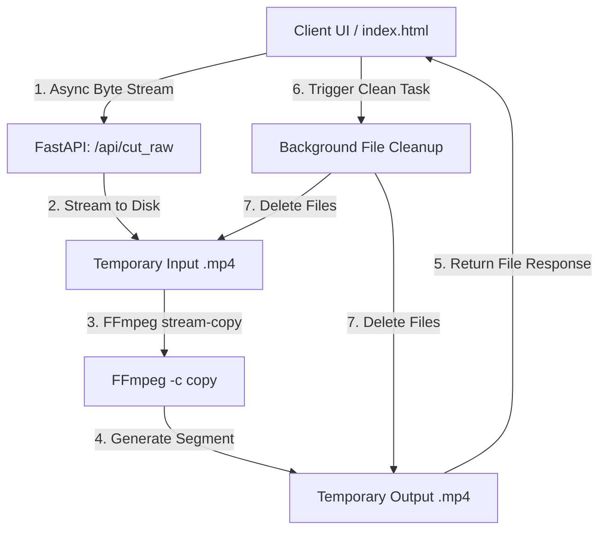

# ⚡ ViralCut Pro — Instant, Zero-Reencoding Video Trimming API 🚀

[](https://fastapi.tiangolo.com)
[](https://ffmpeg.org)
[](https://python.org)

**ViralCut Pro** is an ultra-high-speed, local-first video trimming engine designed to cut viral video clips instantaneously. Built on **FastAPI** and powered by **FFmpeg**, it bypasses standard python-multipart file handling bugs on large files by leveraging direct asynchronous byte streaming to cut and deliver clips in milliseconds.

---

## ✨ Core Features & Technical Highlights

### ⚡ 1. Direct Async Byte Streaming
*   **Bypasses Memory Overhead:** Standard multipart forms load huge video files into memory, causing system lags. ViralCut streams raw bytes directly from the request stream (`request.stream()`) to local temporary storage.
*   **Highly Scalable:** Handles large video files smoothly on low-spec hosting environments.

### ⏱️ 2. Zero-Reencoding Trimming (`-c copy`)
*   **Instant Cut Execution:** Uses FFmpeg’s stream-copy command (`-c copy`), meaning the audio and video streams are sliced instantly without heavy CPU re-encoding.
*   **Original File Integrity:** Retains the exact pixel quality, color profiles, frame rates, and audio bitrates of the raw source video.

### 🧹 3. Proactive Background Cleanup
*   **Zero Storage Leaks:** Employs FastAPI's `BackgroundTasks` queue to safely wipe all uploaded and generated temporary videos from disk *after* the cut file is successfully returned to the client.
*   **Self-Cleaning Environment:** Ensures local server disk space remains fully optimized under massive, repeated API calls.

---

## 🏗️ Technical Architecture & Pipeline



---

## 🚀 How to Set Up & Run Locally

### 1. Prerequisites
*   **Python:** Install Python `3.10` or higher.
*   **FFmpeg:** Ensure FFmpeg is installed and added to your System PATH variables.

### 2. Install Dependencies
```bash
pip install fastapi uvicorn
```

### 3. Run the Server
```bash
python app.py
```
The server will spin up on `http://localhost:8000`. 

### 4. Interactive Frontend
*   Open `index.html` in your browser to interact with the responsive visual clipper dashboard, select your start and end frames, and get your trimmed clips instantly!

---

## 👤 Developer Profile

Designed and engineered by **Oğuz Emir Topuz**.

*   **Age:** 14
*   **Passions:** Football Analyst & Advanced Fullstack Software Developer.
*   **Connect:** [My GitHub Portfolio](https://github.com/oguzemirtopuz)
